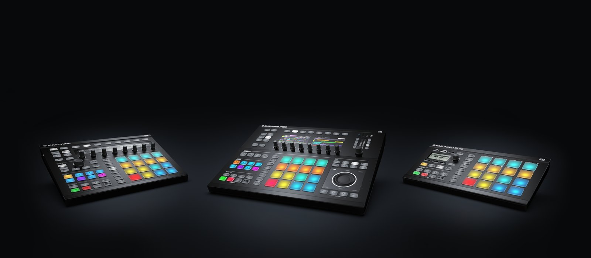
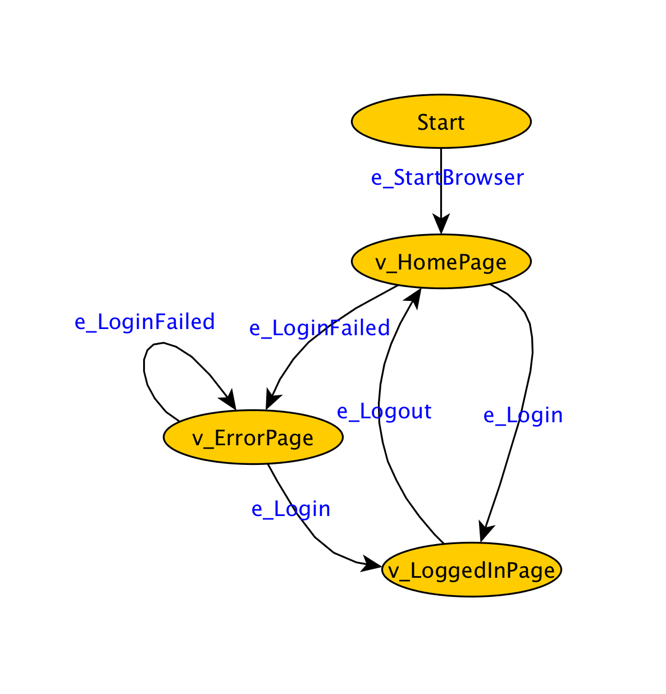

# [fit] Model Based Testing 
## [fit] With Graphwalker

---

# Native Instruments & Maschine

---

## [fit] Testing requires tooling that can cope with
## [fit] Combinatorial Complexity

---

# Model Based Testing

- Model system as a graph (finite state machine)
- Generate testcases by randomly walking over graph 
 
- Tests are more *flexible*
- Tests find *new bugs*

---

## Building the Graph

- Nodes are states to be verified
- Edges are actions to be taken

---

## [fit] Demonstration :information_desk_person:

---

## [fit]Questions? :pray:
